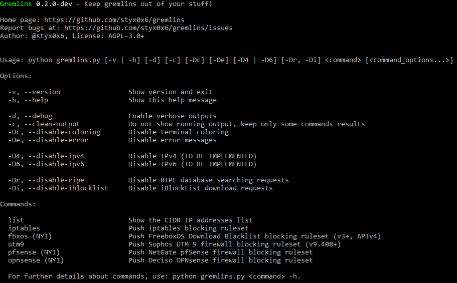

Version originale ici: [[README](README.md)]

# Gremlins

À propos de
----

**Gremlins** est un outil _open source_ créé pour vous aider à protéger votre vie privée en laissant les petits *gremlins* loin de vos affaires!

Tout à commencé [ici](http://seclists.org/fulldisclosure/2011/May/434) et avec la loi "HADOPI".

Beaucoup d'entités dans le monde, comme l'agence HADOPI en France par exemple, espionnent vos services internet auto-hébergés et privés, comme le partage de fichiers, tout particulièrement sur BitTorrent, et autres ... Les droits fondamentaux qui appartiennent à chacun sont évidemment de pouvoir bloquer n'importe lesquels de ces entités qui voudraient être un peu trop curieuses sur nos affaires, et bien sûr, les empêcher d'accéder à nos fichiers et services sur la base de notre simple volonté !

Si vous pouvez empêcher n'importe qui d'accéder physiquement à votre maison, vous devez alors être capable de faire la même chose sur vos services internet.

Le but principal de cet outil est de facilité le blocage de ces *gremlins* vers et depuis vos services BitTorrent.

**Comment ça fonctionne ?**

Le script construit une politique de blocage basée sur les adresses IPv4/IPv6 fournies par **iBlockList** et la base de données du **RIPE**. Les requêtes se basent sur des mots-clés prédéfinis afin de ne pas bloquer tout internet non plus ... Puis, il paramètre automatiquement la politique de blocage sur plusieurs types d'équipements :

* Serveurs basés sur Linux avec **iptables**
* **Sophos UTM 9** firewall (v9.408+)
* **FreeboxOS** Download (v3+, APIv4) _- NOT YET IMPLEMENTED_
* NetGate **pfSense** firewall _- NOT YET IMPLEMENTED_
* Deciso **OPNsense** firewall _- NOT YET IMPLEMENTED_

Aussi, le script peut simplement générer la liste de blocage sous format CSV :

    <CIDR_IP_RANGE>,<VERSION>,<SOURCE>,<MATCHED_KEYWORD>,<NAME>

_**Attention :**_

Cet outil a été créé pour aider les gens à se protéger contre la surveillance des entités externes (gouvernementales ou non). Vous pouvez protéger, avec l'aide de cet outil, vos services de partage de la même manière que vous le feriez avec votre maison contre les cambrioleurs.

Le fait de protéger votre infrastructure et vos services de tout espionnage par des intrus, que l'on appelle ici les *gremlins*, ne vous autorise **PAS** à partager du contenu protégé et sous _copyright_ sans autorisation. Les développeurs et contributeurs de Gremlins ne sont pas responsables de vos actes et ne vous encouragent **EN RIEN** à faire toute action illégale.

_**Le script ne garanti pas une protection complète contre les gremlins, la liste ne peut pas être garantie comme exhaustive car elle est générée sur base de mots-clés. Aussi, il est possible que la liste générée contienne des faux-positifs mais il vaut mieux en avoir trop que pas assez.**_

Restez dans le droit chemin, faites des choses légales, protégez votre vie privée contre les *gremlins* et que la force soit avec vous.

Installation
----

Vous pouvez télécharger la dernière archive tar en cliquant [ici](https://github.com/styx0x6/gremlins/tarball/master) ou la dernière archive zip en cliquant [ici](https://github.com/styx0x6/gremlins/zipball/master).

De préférence, téléchargez Gremlins en clonant le répertoire [Git](https://github.com/styx0x6/gremlins) :

    git clone --depth 1 https://github.com/styx0x6/gremlins.git gremlins

Gremlins fonctionne _out of the box_ avec [Python](http://www.python.org/download/) version **3.4** ou plus sur toutes les plateformes.
Les librairies et dépendances sont incluses avec le script pour plus de simplicité.

Guide de démarrage
----

`python gremlins.py [-v | -h] [-d] [-c] [-Dc] [-De] [-D4 | -D6] [-Dr, -Di] <command> [<command_options...>]`

`python gremlins.py list [-h]`

Liens
----

* Page d'accueil : https://github.com/styx0x6/gremlins
* Téléchargement : [.tar.gz](https://github.com/styx0x6/gremlins/tarball/master) ou [.zip](https://github.com/styx0x6/gremlins/zipball/master)
* Répertoire Git: git://github.com/styx0x6/gremlins.git
* Issues tracker: https://github.com/styx0x6/gremlins/issues

Roadmap & Changelog
----

Tous les détails sont ici : [[CHANGELOG](CHANGELOG.md)]

Contributions
----

N'hésitez pas à soumettre vos *bugs* et améliorations par *pull requests* !

[[Bugs & Support](https://github.com/styx0x6/gremlins/issues)]  
[[How to contribute to a project on Github](https://gist.github.com/MarcDiethelm/7303312)] by Marc Diethelm

*dev* branch status:  

Librairies tierces
----

* **Shields.io** - Badges as a service.

      
    [http://shields.io/](http://shields.io/)  
    [https://github.com/badges/shields/](https://github.com/badges/shields/)

Gremlins inclus directement des librairies tierces, leurs licences et termes associés sont disponibles ci-dessous :

* **colorama-0.3.7** - La librairie Colorama disponible dans `thirdparty/colorama/`.

    Copyright (C) 2013, Jonathan Hartley.  
      
    [https://pypi.org/project/colorama/](https://pypi.org/project/colorama/)  
    [https://github.com/tartley/colorama/](https://github.com/tartley/colorama/)

* **paramiko-2.1.1** - La librairie Paramiko disponible dans `thirdparty/paramiko/`.

    Copyright (C) 2003-2011, Robey Pointer.  
    Copyright (c) 2013-2018, Jeff Forcier.  
      
    [http://www.paramiko.org/](http://www.paramiko.org/)  
    [https://github.com/paramiko/paramiko/](https://github.com/paramiko/paramiko/)

* **requests-2.13.0** - La librairie Requests disponible dans `thirdparty/requests/`.

    Copyright (C) 2016, Kenneth Reitz.  
      
    [http://docs.python-requests.org/](http://docs.python-requests.org/)  
    [https://github.com/requests/requests/](https://github.com/requests/requests/)
