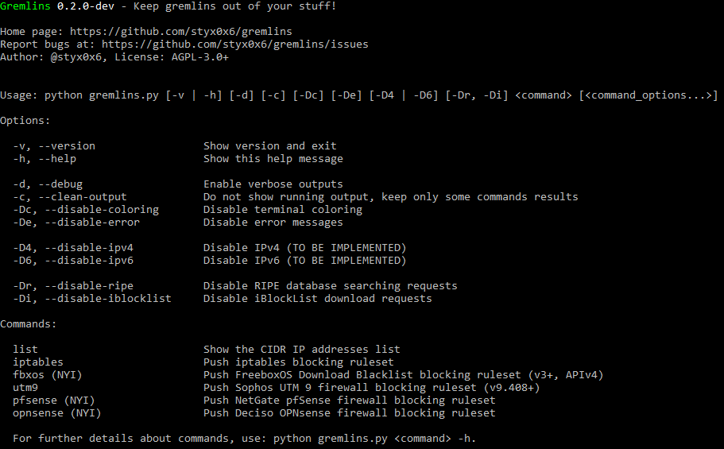

French version here: [[README-FR](README-FR.md)]

# Gremlins

About
----

**Gremlins** is an open source tool made to help you to protect your privacy by keeping the little *gremlins* out of your stuff!

All started [here](http://seclists.org/fulldisclosure/2011/May/434) and with the "HADOPI" french law.

A lot of entities in the world, like the HADOPI agency in France by example, are spying your private and self-hosted
internet-fronted services, like file sharing, especially on BitTorrent, and others... The fundamentals rights that belong to
each one of us are obviously to be able to block any of these entities that would like to be too much curious on our
stuff, and also, prevent them to access our files and services based on our simple desire!

If you can prevent anyone to physicaly access your home, you must also be able to do the same on your internet-fronted
services.

The main purpose of this tool is to facilitate the blocking of these *gremlins* onto and from your BitTorrent services.

**How it works?**

The script build a blocking policy based on IPv4/IPv6 addresses from **iBlockList** and the **RIPE** database. Requests
are based on predefined keywords in order to don't block the whole internet... Then, it had the capability to
automatically set the blocking policy on many devices:

* Linux-based servers via **iptables**
* **Sophos UTM 9** firewall (v9.408+)
* **FreeboxOS** Download (v3+, APIv4) _- NOT YET IMPLEMENTED_
* NetGate **pfSense** firewall _- NOT YET IMPLEMENTED_
* Deciso **OPNsense** firewall _- NOT YET IMPLEMENTED_

Also, the script can simply generate the blocking list in CSV format:

    <CIDR_IP_RANGE>,<VERSION>,<SOURCE>,<MATCHED_KEYWORD>,<NAME>

_**Warning:**_

This tool has been made to help people to prevent them from being monitored by external entities (governmental or not).
You can protect, with the help of this tool, your sharing services in the same way you
would did it with your home against rubbers.

The fact of protecting your infrastructure and services from being stalked by strangers, named here *gremlins*, do
**NOT** allow you to share protected and copyrighted content without any permission. Gremlins developpers and
contributors are not responsible of your acts and they do **NOT** encourage you to do anything wrong or illegal.

_**The script doesn't guarantee a full protection against gremlins, the list isn't guaranteed as exhaustive as
it's generated from requests based on keywords. Also, it's possible that the generated list contains false-positives but
it's better to be safe than sorry.**_

Stay in the right way, do legal things, protect your privacy against *gremlins* and may the force be with you.

Installation
----

You can download the latest tarball by clicking [here](https://github.com/styx0x6/gremlins/tarball/master) or the
latest zipball by clicking [here](https://github.com/styx0x6/gremlins/zipball/master).

Preferably, you can download Gremlins by cloning the [Git](https://github.com/styx0x6/gremlins) repository:

    git clone --depth 1 https://github.com/styx0x6/gremlins.git gremlins

Gremlins works out of the box with [Python](http://www.python.org/download/) version **3.4** and more on any platform.
Libraries and dependancies are embedded within the script for better convenience.

Getting Started
----

`python gremlins.py [-v | -h] [-d] [-c] [-Dc] [-De] [-D4 | -D6] [-Dr, -Di] <command> [<command_options...>]`

`python gremlins.py list [-h]`

Links
----

* Homepage: https://github.com/styx0x6/gremlins
* Download: [.tar.gz](https://github.com/styx0x6/gremlins/tarball/master) or [.zip](https://github.com/styx0x6/gremlins/zipball/master)
* Git repository: git://github.com/styx0x6/gremlins.git
* Issues tracker: https://github.com/styx0x6/gremlins/issues

Roadmap & Changelog
----

All details are here: [[CHANGELOG](CHANGELOG.md)]

Contributing
----

Feel free to submit *issues* and enhancement *pull requests*!

[[Bugs & Support](https://github.com/styx0x6/gremlins/issues)]  
[[How to contribute to a project on Github](https://gist.github.com/MarcDiethelm/7303312)] by Marc Diethelm

*dev* branch status:  

Third-Party Libraries
----

* **Shields.io** - Badges as a service.

      
    [http://shields.io/](http://shields.io/)  
    [https://github.com/badges/shields/](https://github.com/badges/shields/)

Gremlins includes bundled packages and below are their associated licensing terms:

* **colorama-0.3.7** - The Colorama library located in `thirdparty/colorama/`.

    Copyright (C) 2013, Jonathan Hartley.  
      
    [https://pypi.org/project/colorama/](https://pypi.org/project/colorama/)  
    [https://github.com/tartley/colorama/](https://github.com/tartley/colorama/)

* **paramiko-2.1.1** - The Paramiko library located in `thirdparty/paramiko/`.

    Copyright (C) 2003-2011, Robey Pointer.  
    Copyright (c) 2013-2018, Jeff Forcier.  
      
    [http://www.paramiko.org/](http://www.paramiko.org/)  
    [https://github.com/paramiko/paramiko/](https://github.com/paramiko/paramiko/)

* **requests-2.13.0** - The Requests library located in `thirdparty/requests/`.

    Copyright (C) 2016, Kenneth Reitz.  
      
    [http://docs.python-requests.org/](http://docs.python-requests.org/)  
    [https://github.com/requests/requests/](https://github.com/requests/requests/)
